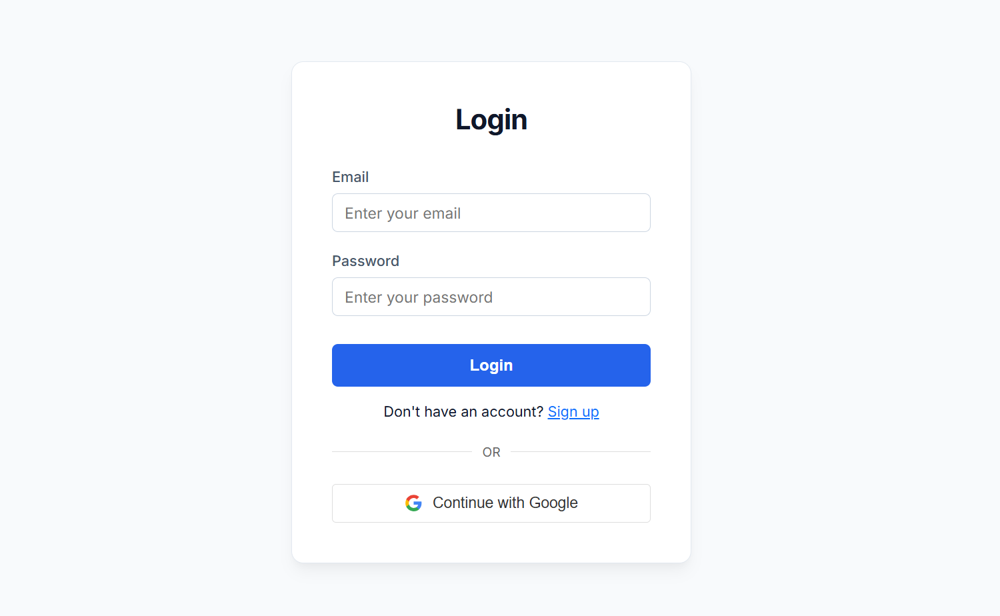
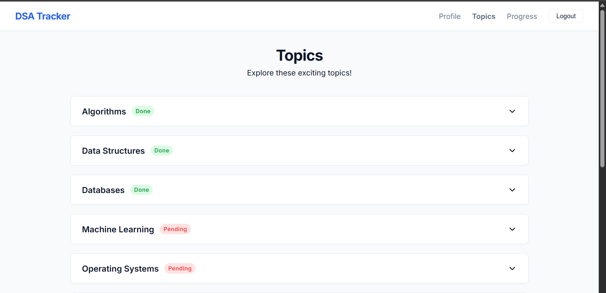
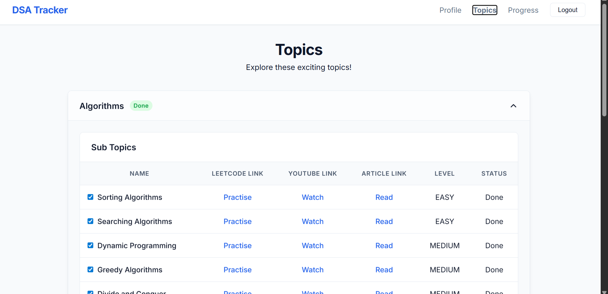
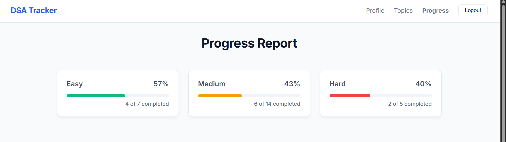

# 🚀 DSA Tracker

A full-stack MERN application designed to help users track their Data Structures & Algorithms journey efficiently. The platform allows users to organize learning topics, monitor progress, access curated resources, and visualize completion statistics through an intuitive dashboard.

Built with **MongoDB, Express.js, React.js, Node.js**, and **Firebase Authentication** for secure login and user management.

---

## 📌 Project Overview

DSA Tracker solves a common challenge faced by students and developers: keeping track of problem-solving progress across multiple DSA topics.

Users can:

✅ Track learning progress  
✅ Mark sub-topics as completed  
✅ Access practice, video, and article resources  
✅ Monitor performance through progress analytics  
✅ Securely authenticate with Firebase login  

---

## ✨ Features

### 🔐 Authentication
- Email/Password authentication
- Google Sign-In using Firebase
- Secure session management
- Protected routes

### 📚 Topic Management
- Categorized DSA topics
- Expandable topic sections
- Topic completion tracking
- Dynamic status updates

### 📈 Progress Dashboard
- Difficulty-wise progress tracking:
  - Easy
  - Medium
  - Hard
- Percentage completion visualization
- Real-time statistics

### 🎯 Learning Resources
Each topic contains:

- LeetCode practice links
- YouTube tutorial links
- Article references
- Difficulty level indicators

### ⚡ User Experience
- Responsive design
- Clean UI
- Fast rendering with React
- Smooth navigation experience

---

## 🛠 Tech Stack

### Frontend
- React.js
- React Router
- CSS
- Axios

### Backend
- Node.js
- Express.js

### Database
- MongoDB

### Authentication
- Firebase Authentication
  - Email Login
  - Google Login

### Other Tools
- Git
- GitHub
- REST APIs

---

## 🏗 Architecture

```text
React Frontend
      ↓
Express REST API
      ↓
Node.js Server
      ↓
MongoDB Database

Firebase Authentication
      ↓
User Authentication + Session Handling
```

---

## 📸 Screenshots

### Login Page



---

### Topics Dashboard



---

### Expanded Topic View



---

### Progress Analytics



---

## ⚙ Installation & Setup

### Clone repository

```bash
git clone https://github.com/yourusername/dsa-tracker.git
```

### Move into project

```bash
cd dsa-tracker
```

### Install frontend dependencies

```bash
cd client
npm install
```

### Install backend dependencies

```bash
cd ../server
npm install
```

### Configure environment variables

Create a `.env` file:

```env
PORT=5000

MONGO_URI=your_mongodb_connection

FIREBASE_API_KEY=your_api_key
FIREBASE_AUTH_DOMAIN=your_auth_domain
FIREBASE_PROJECT_ID=your_project_id
FIREBASE_STORAGE_BUCKET=your_storage_bucket
FIREBASE_MESSAGING_SENDER_ID=your_sender_id
FIREBASE_APP_ID=your_app_id
```

### Run frontend

```bash
npm start
```

### Run backend

```bash
npm run dev
```

---

## REST API Endpoints

### Authentication

```http
POST /api/auth/login
POST /api/auth/register
```

### Topics

```http
GET /api/topics
POST /api/topics
PUT /api/topics/:id
```

### Progress

```http
GET /api/progress
```

---

## 📊 Key Learning Outcomes

This project helped strengthen:

- Full-stack MERN architecture understanding
- Firebase Authentication integration
- REST API development
- MongoDB schema design
- React state management
- Protected routing
- CRUD operations
- Component-based design principles

---

## 🔮 Future Improvements

- Dark mode support
- Personalized recommendations
- Streak tracking
- Coding challenge reminders
- Leaderboards
- Notes section
- Advanced analytics dashboard

---

## 👨‍💻 Why this project matters

This project demonstrates practical full-stack engineering skills beyond simple CRUD functionality:

- Authentication & authorization
- Scalable MERN architecture
- API integration
- Database management
- State management
- UI/UX implementation
- Real-world problem solving

---

## 👤 Author

**Aniket Ray**

GitHub: https://github.com/aniketray01

LinkedIn: https://www.linkedin.com/in/aniket-ray/

---

⭐ If you found this project useful, consider giving it a star.
